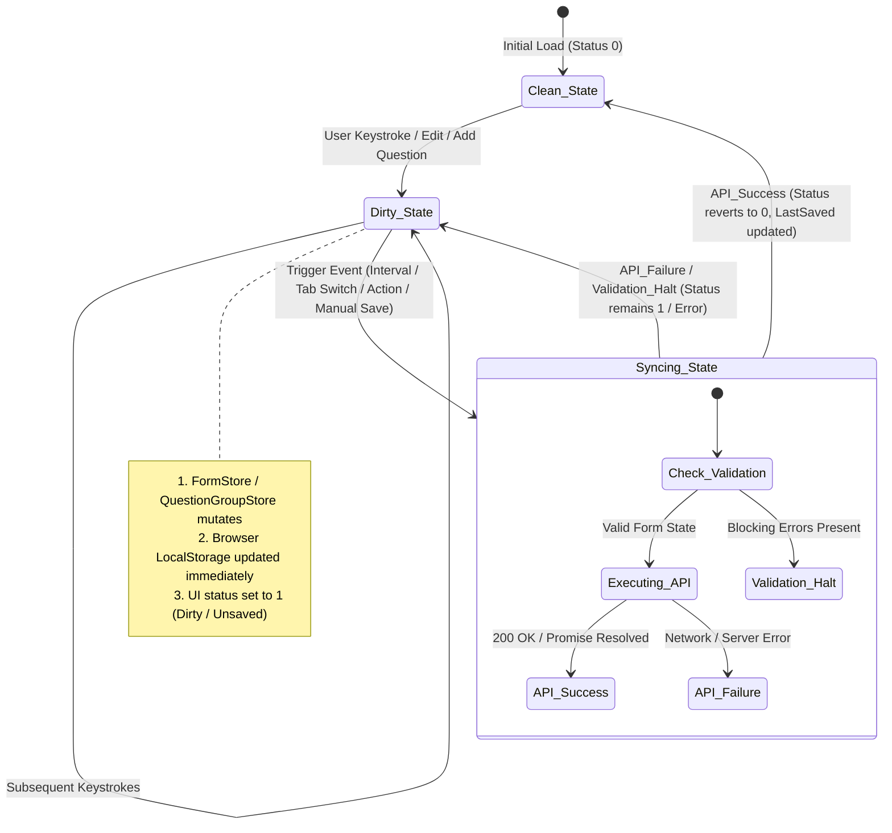

# Requirements: Auto-Save in Form Editor

> Linked Issue: [#80](https://github.com/akvo/akvo-react-form-editor/issues/80)

## 1. Executive Summary & 5W1H Analysis

| Question | Detail |
|:---|:---|
| **Who** | Form designers, survey creators, and administrators in `akvo-react-form-editor` / `akvo-mis-editor`. |
| **What** | Multi-tier auto-save architecture combining immediate browser-side local storage caching on keystrokes with debounced / event-driven background API synchronization. |
| **Where** | Frontend React component library (`akvo-react-form-editor`) in `src/lib/store.js`, `src/lib/storage.js`, `src/hooks/useAutoSave.js`, `src/index.js`, and `src/support/`. |
| **When** | **Immediate (0ms / keystroke)**: Browser storage cache + status transition to `1 (dirty)`.<br>**Periodic (e.g., 30s interval)**: Check status; if `1`, trigger API sync.<br>**Event-Driven**: Tab switch (`edit-form` -> `translations` -> `preview`), question additions/deletions, or component unmount. |
| **Why** | Prevent loss of extensive form design work due to accidental browser closure, accidental navigation, power cuts, or keyboard slips, while eliminating API server strain by avoiding network calls per keystroke. |
| **How** | Two-tier decoupling: Browser Storage Cache for sub-millisecond resilience + Status Table (`0 = saved`, `1 = dirty`) + Async Sync Manager for remote persistence. |

---

## 2. Technical Alignment with TAC (Deden)

> **TAC Directives**:
> 1. *Do not hit API endpoints on keystrokes.* Keystrokes update local storage cache immediately.
> 2. *Configurable autosave time interval* (frontend hardcoded / prop defaults, not ENV).
> 3. *Local cache status table*: `1` for changed/dirty, `0` for saved (post-API sync). Only hit endpoint when status is `1`.
> 4. *Check and sync triggers*: Keystroke sets status `1`. Tab/page switch triggers check and sync. On successful sync, revert status to `0`.

---

## 3. Architecture Overview & State Machine



---

## 4. Trigger Matrix & Performance Guardrails

| Trigger Source | Condition | Action Taken | Network Overhead |
|:---|:---|:---|:---|
| **Keystroke / Input Field** | Form/Question store change | Serialize to `localStorage` draft cache; set `status = 1`. | **0 requests** |
| **Auto-Save Interval** | `status === 1` AND timer fires (default 30s) | Validate store; call `onAutoSave` / `onSave`; on success set `status = 0`. | Low (max 1 req / 30s) |
| **Tab Navigation** | Tab switch (`edit-form`, `translations`, `preview`) | Check `status === 1`; immediately invoke sync before rendering target tab. | 1 request (only if dirty) |
| **Add / Duplicate Question** | Structural mutation | Save to cache; set `status = 1`; schedule immediate sync or interval. | 1 request |
| **Manual Save Button** | User click on Save | Run full validation; call `onSave`; display success/error notification; set `status = 0`. | 1 request |
| **Window Unload / Exit** | Tab close / reload with `status === 1` | Standard browser `beforeunload` warning prompt if unsaved changes exist in memory. | 0 requests (prevents loss) |

---

## 5. Storage Cache & Status Table Schema

The local cache lives in `localStorage` under structured keys:

```json
// Key: arfe_status_<formId>
{
  "formId": 1698765432,
  "status": 1, // 0 = saved (clean), 1 = changed (dirty)
  "lastUpdated": 1727789123456,
  "lastSaved": 1727789100000,
  "saveInProgress": false,
  "lastSaveRequestTimestamp": 1727789110000,
  "hasErrors": false
}

// Key: arfe_draft_<formId>
{
  "form": { "id": 1698765432, "name": "Survey Title", "version": 1 },
  "questionGroups": [ ... ]
}
```

---

## 6. Critical Concurrency & Edge-Case Mitigations

1. **Timestamp-Based Status Reconciliation (`[DATA]`)**:
   - When an API sync is triggered at $T_{req}$, the store records $T_{req}$.
   - If the user types at $T_{edit} > T_{req}$ while the API request is in-flight, `lastUpdated` is updated to $T_{edit}$.
   - When the API request successfully resolves at $T_{res}$, status is set to `0` **ONLY IF** `lastUpdated <= T_req`. If $T_{edit} > T_{req}$, status remains `1` (dirty) and a subsequent sync will pick up the new changes.
2. **Serialization Throttling (`[PERF]`)**:
   - While dirty flag transition is immediate ($0ms$), writing the serialized JSON payload to `localStorage` is throttled by $150ms$ to ensure zero main-thread jank when typing rapidly on 500+ question forms.
3. **Storage Quota & Private Browsing Fallback (`[ERR]`)**:
   - `localStorage` operations are encapsulated with `try/catch`. If `QuotaExceededError` or disabled storage is encountered, fallback gracefully to an in-memory map without interrupting the editor session.
4. **Validation Separation (Auto-Save vs Manual Save) (`[ARCH]`)**:
   - Auto-save checks `ErrorStore`. If blocking errors exist, auto-save saves locally to browser storage but does not pop intrusive error modals, preserving user flow while keeping local work safe.

---

## 7. Compatibility & Host Contract

- **Backward Compatibility**: `WebformEditor` maintains full backwards compatibility with existing `onSave` prop.
- **New Props (Optional)**:
  - `onAutoSave?: (webformJson, meta: { isAutoSave: boolean }) => Promise<void> | void`
  - `autoSaveInterval?: number` (default: `30000` ms = 30s)
  - `enableAutoSave?: boolean` (default: `true`)
  - `enableDraftRecovery?: boolean` (default: `true`)
- **Async Awareness**: If `onSave` / `onAutoSave` returns a Promise, `WebformEditor` waits for resolution before transitioning status from `saving` to `0 (saved)`.
