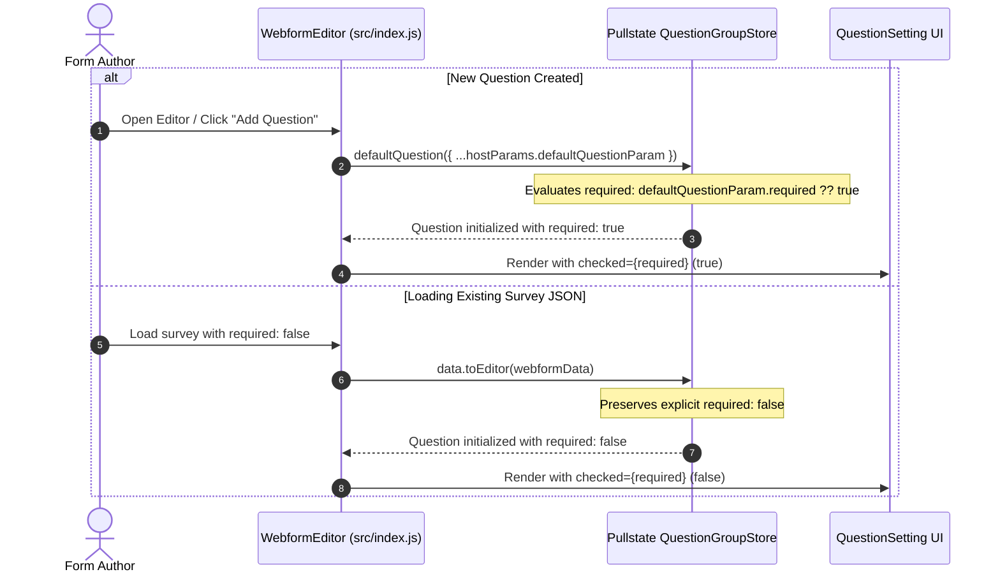

# Make "Required" Default Selected for Questions - Feature Specification

> **Status**: APPROVED
> **Target Path**: `plan/default-required-question/spec.md`
> **Related Issue**: [#78](https://github.com/akvo/akvo-react-form-editor/issues/78)
> **Branch**: `feature/78-make-required-default-selected`

---

## 1. 5W1H Requirements Analysis

- **Who**: Survey designers / Form authors using `akvo-react-form-editor`.
- **What**: Newly created questions should default to `required: true` (Mandatory checkbox checked) while preserving host override capability and backwards compatibility for existing forms.
- **Where**:
  - `src/lib/store.js` (`defaultQuestion` factory)
  - `src/index.js` (`sanitizeDefaultQuestion` host param sanitizer)
  - `src/lib/__tests__/store.test.js` (unit tests)
- **When**: Triggered upon opening a fresh form editor with no initial value, or when clicking "Add Question" / "Add Group".
- **Why**: Eliminates repetitive manual configuration for form authors since the vast majority of survey questions are mandatory by default.
- **How**:
  1. Change default parameter `required = true` in `defaultQuestion` inside `src/lib/store.js`.
  2. Use null-safe fallback in `src/index.js` (`defaultQuestion?.required ?? true`) to allow explicit host overrides.
  3. Ensure `toEditor` in `src/lib/data.js` retains existing `required: false` values when loading existing surveys.

---

## 2. Overview & Architecture

### Sequence / Flow



---

## 3. Implementation Details

### 3.1 Store Foundation
**File**: `src/lib/store.js`

- Update `defaultQuestion` function signature:
  ```js
  const defaultQuestion = ({
    questionGroup,
    label,
    name,
    prevOrder = 0,
    type = questionType.input,
    required = true, // Changed from false to true
    params = {},
  }) => { ... }
  ```

### 3.2 Host Configuration Handling
**File**: `src/index.js`

- In `useEffect` sanitization:
  ```js
  const sanitizeDefaultQuestion = {
    type: defaultQuestion?.type || questionType.input,
    name: defaultQuestion?.name,
    required:
      defaultQuestion?.required !== null &&
      defaultQuestion?.required !== undefined
        ? defaultQuestion.required
        : true,
  };
  ```

### 3.3 Data Transformation Verification
**File**: `src/lib/data.js`

- No modifications needed in `data.js`. Verify `toEditor` preserves explicit `q.required` boolean values from incoming payloads.

---

## 4. Verification & Testing Plan

### 4.1 Automated Tests (`yarn test:unit`)
Add unit tests in `src/lib/__tests__/store.test.js` (or dedicated test block):
1. `defaultQuestion({ questionGroup: { id: 1 } })` creates question with `required: true`.
2. `defaultQuestionGroup({})` child question has `required: true`.
3. `defaultQuestion({ questionGroup: { id: 1 }, required: false })` respects explicit `false`.
4. `toEditor` preserves `required: false` on imported questions.

### 4.2 Manual Verification
1. Run `cd example && yarn start`.
2. Observe initial default question in newly opened form — "Mandatory" checkbox is checked.
3. Click "Add Question" — new question is created with "Mandatory" checked.
4. Click "Add Group" — group's initial question is created with "Mandatory" checked.
5. Toggle "Mandatory" off, export/preview form, and verify `required: false` is honored.

---

## 5. Epic & Vibe Coding Estimation ⏱️

- **Confidence Level**: High
- **Dependencies**: None

| Task ID | Component & Description | Vibe Coding (Dev) | Automated Testing | QA & Review | Total Est. Time | Priority |
| :--- | :--- | :---: | :---: | :---: | :---: | :--- |
| **REQ-01** | Update `defaultQuestion` default argument in `src/lib/store.js` and nullish fallback in `src/index.js` | 15m | 10m | 5m | **30m (0.5h)** | High |
| **REQ-02** | Add comprehensive unit tests in `src/lib/__tests__/store.test.js` & regression check for `toEditor` | 10m | 15m | 5m | **30m (0.5h)** | High |
| **Total** | **Full Feature Delivery** | **25m** | **25m** | **10m** | **60m (1.0h)** | - |

